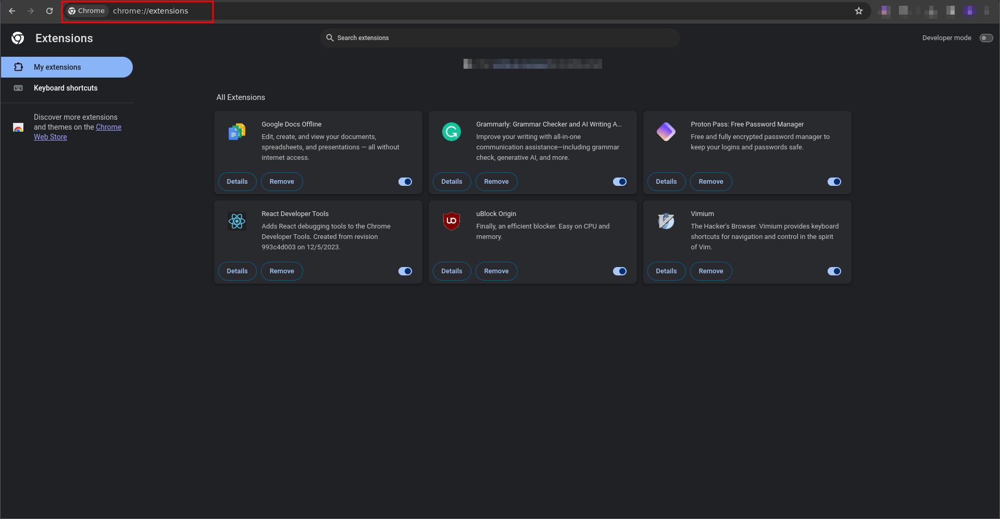
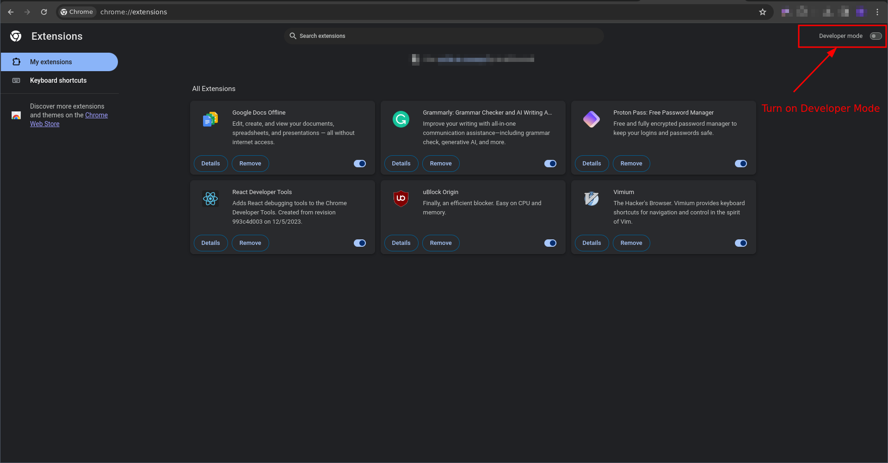
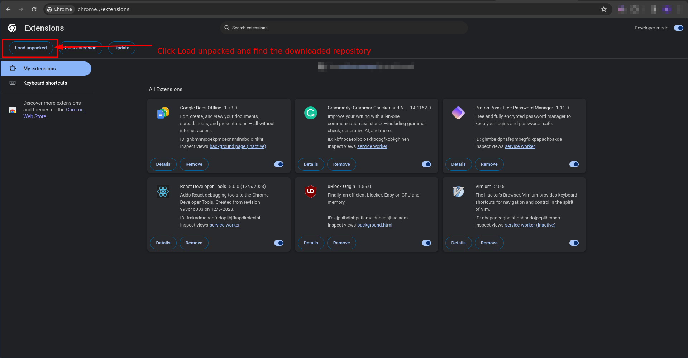
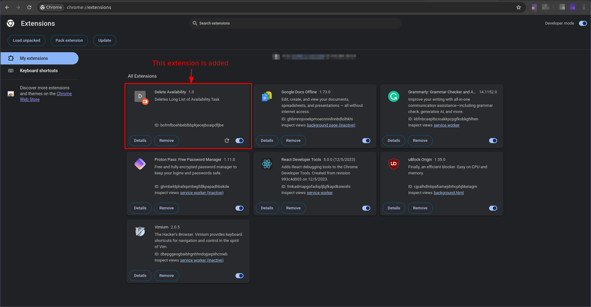

# Manticore-Chrome-Extension

Fix for manticore issue with long list of `Upcoming availability blocks over the next 24 hours.`, which hides the start button.

**To add the extension to chrome browser:**

1. Download this repository:
   ```bash
   https://github.com/NutanPanta/Manticore-Chrome-Extension
   ```
2. Open Google Chrome Extensions: `chrome://extensions/`:

   

3. **Turn on Developer Mode:**
   
   After turning on the developer mode `Load Unpacked` button must be visible.
4. **Add Repository to the extensions using load unpacked button:**
   
5. **Extension must appear in All Extensions:**
   

Hurray you added the extension to the browser. Now the extension must have been added. You can go and check in the app if the issue has been fixed or not.
